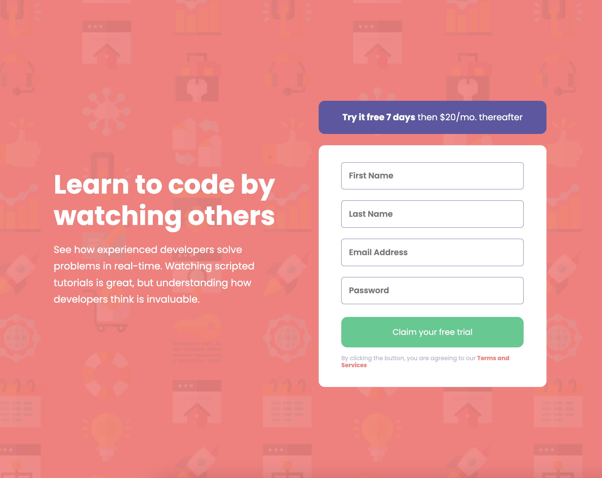
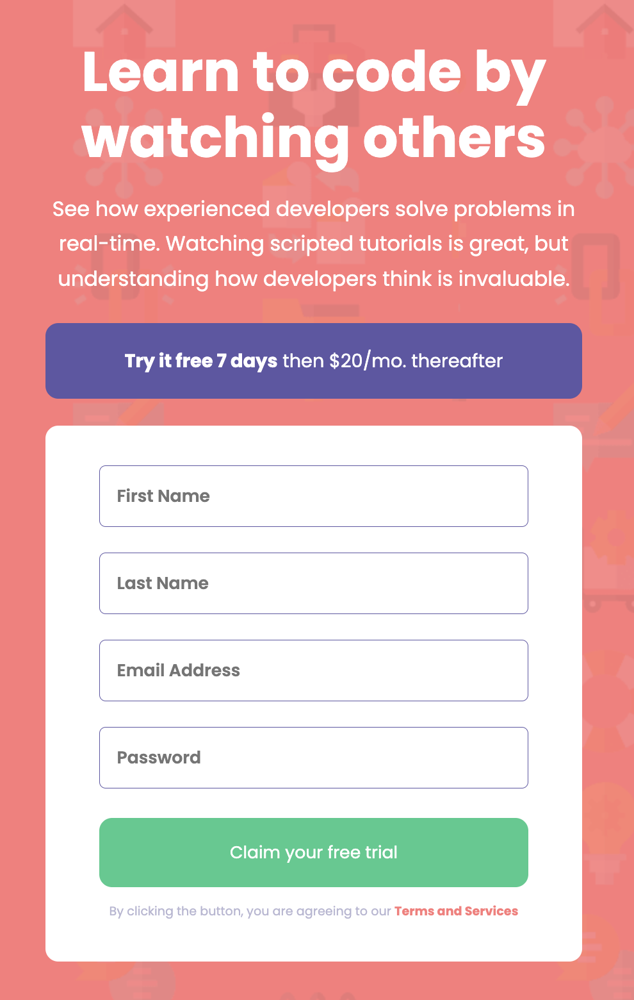

### Screenshot

Desktop Version

Mobile Version

### Links

- Solution URL: https://github.com/whitneywind/form-validation-practice
- Live Site URL: [Add live site URL here](https://your-live-site-url.com)

## Overview

This is a solution to the [Intro component with sign up form challenge on Frontend Mentor](https://www.frontendmentor.io/challenges/intro-component-with-signup-form-5cf91bd49edda32581d28fd1).

### The challenge

Users should be able to:

- View the optimal layout for the site depending on their device's screen size
- See hover states for all interactive elements on the page
- Receive an error message when the `form` is submitted if:
  - Any `input` field is empty. The message for this error should say *"[Field Name] cannot be empty"*
  - The email address is not formatted correctly (i.e. a correct email address should have this structure: `name@host.tld`). The message for this error should say *"Looks like this is not an email"*

### Built with

- Semantic HTML5 markup
- CSS custom properties
- Flexbox
- Media Queries
- Vanilla JavaScript
- JavaScript's Constraint Validation API

### What I learned

- JS constraint validation 
- a LOT about forms validation in HTML and in JS and how challenging it is to change it from the default

## Author

- Website - (https://whitneywind.github.io/portfolio-site/)
- Frontend Mentor - (https://www.frontendmentor.io/profile/whitneywind)

